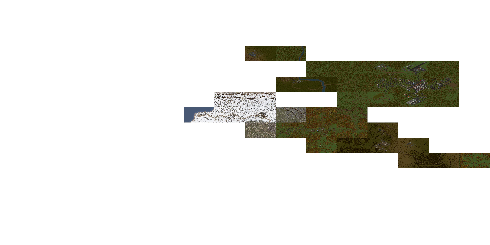

# UB-AIMNAS Combined Tactical World Map (JA2)

A self-contained website that decodes the **JA2 Unfinished Business + AIMNAS** mod data and stitches
its tactical maps into **one big, zoomable world map** — rendered the same way the game draws each
sector (full isometric tile graphics, not the low-res radar minimaps). This is a sibling of the
**Arulco** `webmap` instance, sharing its renderer/viewer but adapted to the mod's data layout.

It's the familiar strategic 16×16 grid (A–P rows down, 1–16 columns across), with each sector laid
out as a square tile so they tessellate into one seamless map. UB uses a subset of the grid (roughly
rows D–K, columns 7–15). Pan and zoom anywhere; high-detail per-sector tiles stream in as you zoom,
and a **Level** switcher flips between the **Surface** and the underground basement levels. The
**Roofs** toggle hides roofs to reveal interiors (surface).



## What's different from the Arulco `webmap`

UB-AIMNAS is a mod that layers on top of a base JA2 1.13 install (`../JA2/Data`) via the engine's VFS,
so the data layout differs — the adaptations live in `build/config.js`, `build/tilesets.js`, and
`build/build.js`:

- **Bigmaps.** The tactical maps are **360×360 tiles** (vs the standard 160×160) — ~5× the area. The
  `.dat` header carries the real dimensions, and `warpToContentSquare` takes a `gridMax` argument so
  the content-diamond un-projection scales to the map (359 instead of 159). The native iso render is
  ~`14400×7200`; tiles are downsampled to `3200×1600` (same in-browser cost as the Arulco tiles, but
  fewer px per game-tile — bump `TILE_W/TILE_H` in `build.js` for more detail at a memory/perf cost).
- **Loose maps.** `MAPS/*.dat` loose files (mixed-case), no `Maps.slf`.
- **Binary tileset table.** The mod ships `BinaryData/JA2SET.DAT` (binary), not `Ja2Set.dat.xml`.
  `tilesets.js` parses it directly: `u8 numSets, u32 numFileTypes`, then per set `char[32] name`,
  `u8 ambientId`, `numFileTypes × char[32]` tile-surface filenames (format from
  `source/TileEngine/WorldDat.cpp`).
- **Loose tileset graphics + base SLF.** Tile STIs are resolved from the mod's loose `Tilesets/<id>/`
  (and `/T/`) overrides first, then the **base game's `Tilesets.slf`**, then the generic tileset (0).
  (For the UB maps this resolves with **0 missing tiles**.)
- **Overlays not yet adapted.** Towns/mines/SAM/etc. read the base game's TableData layout; for now
  the build emits an empty overlay skeleton (the markers/legend render but are empty). Adapting
  `overlays.js` to the UB-AIMNAS `TableData` is the main remaining TODO.

## What it does

A Node build step (zero npm dependencies — pure Node built-ins) reads the game's own files:

- the tactical `.dat` maps — resolved by JA2 1.13 VFS priority so it's the **full 1.13 set**:
  `Data-1.13/Maps/` (loose) overrides `Data/Maps/` (loose) overrides `Data/Maps.slf` (vanilla).
  In this install 15 sectors come from the loose 1.13/Data overrides, the rest from `Maps.slf`.
- `JA2/Data/Tilesets.slf` + `JA2/Data/Ja2Set.dat.xml` — the tile graphics & per-tileset tile→file table
- `JA2/Data/TableData/Map/*.xml` + `TableData/Army/*.xml` + `Scripts/initmines.lua` + `Mod_Settings.ini`
  — sector names, towns, SAM sites, mines (mineral/income/sublevels), difficulty (coolness), facilities,
  bloodcats, heli/airport, enemy garrisons & patrol routes, terrain/roads (MovementCosts), creature
  zones (CreaturePlacements), quest/POI sectors (caches, Madlab, Tixa prison, Bobby Ray, …),
  NPC/shopkeeper home sectors (MercProfiles + Merchants) with town militia caps, and per-map loot
  (world-item spawns decoded straight from each tactical `.dat` and named via Items.xml)

…decodes the SLF archives, ETRLE/STI images and `.dat` maps from scratch, renders each
sector isometrically, and emits:

- `dist/overview_<level>.{webp,png}` — the whole grid composited into one image, per level
  (`surface`, `b1`, `b2`, `b3`)
- `dist/sectors/<CODE>.{webp,png}` — per-sector high-detail tiles, loaded on demand when you zoom in
  (underground tiles keep their suffix, e.g. `A10_B1.webp`). With `--webp` (the committed default) the
  build emits **WebP** (lossy `-q`, but the transparent tile-corner cutouts stay lossless) via the
  system `cwebp`. Tiles ship at **`3200×1600`** (half the iso render's native `6400×3200`) at quality
  88 — sharp enough for the art while keeping each tile's in-browser decode to ~20 MB so even weaker
  devices stay smooth (a native `6400×3200` tile decodes to ~82 MB). Without `--webp` it falls back to
  **8-bit indexed PNG**.
- `dist/sectors/<CODE>_roof.{webp,png}` — surface only: a **transparent roof-only overlay** that pairs
  with a **roofless base** `<CODE>.webp` (the base shows building interiors). The viewer composites the
  overlay over the base when *Roofs* is on and skips it when off, so roofs toggle at runtime with no
  second full tile set — both passes share one bounding box so they warp pixel-aligned. Mostly
  transparent, so the overlays add only ~15 MB. Same split for `overview_surface_roof.{webp,png}`.
- `dist/manifest.json`, `dist/overlays.json`, `dist/data.js` — level + overlay metadata

The viewer (`index.html` + `app.js`, a dependency-free `<canvas>` app) is one cohesive control
panel: a **Level** switcher (Surface / Basement 1–3), Grid, High-detail and **Roofs** toggles (Roofs
off reveals building interiors on the surface), an interactive
**Layers legend** (each row a show/hide checkbox — Town, Mine, SAM, Heli, **Airport (Bobby Ray
delivery)**, **Enemy garrison** ⚔, **Patrol routes**, **Quests & POIs** ★ (rebel hideout, weapon
caches, Madlab, Tixa prison, Kingpin, Tony, hospital…), **Creature zones** 🐛 (sci-fi; surface
emergence sectors + the underground habitats/queen 👑 lairs, shown on their real basement level),
**NPCs & dealers** 🧍/💲 (story NPCs + arms dealers' home sectors), **Loot** 📦 (notable map-item
spawns per sector — guns, ammo, armour, explosives, money), **Roads & rivers** network,
**Terrain/biome** tint, and the **difficulty heatmap** of per-sector "coolness" 0–20), and a docked
sector-info readout. Indicators are drawn as solid-colour silhouette icons fanned along the top of
each sector (matching the legend colours). Plus pan/zoom over the 16×16 grid with A–P / 1–16 labels,
town outlines, a high-detail layer that streams in as you zoom, and rich click-a-sector info (name,
town + militia cap/loyalty, difficulty, water, terrain, facilities, bloodcat danger, heli/airport,
enemy garrison size, mine mineral/income/sublevels, quests/POIs, NPCs/dealers, creature zones, which
levels have a map).

**Controls:** drag to pan, scroll to zoom, click a sector to select (click again / empty space to
deselect); on touch, one-finger drag pans, two-finger pinch zooms, tap selects; arrow keys / WASD
pan, `+`/`−` zoom, `F` fits the whole map, `Esc` deselects. The panel
has a help dialog (`?`), a reset/fit button (`⤢`), a collapse toggle (`‹`/`☰`), and a 🔗 copy-link
button on the selected sector. The view can't be panned off-screen (the map always covers the centre).
**URL:** the hash captures the live view — `#@<col>,<row>,<zoom>[,<SECTOR>]` — so any pan/zoom/selection
is shareable (a bare `#C13` still frames a sector); plus `?level=b1`, `?cool=1`, per-layer `?mine=0`/`?npc=1`.

## Build

```sh
cd webmap
node build/build.js                 # render all sectors (~70s), write overview + manifest + data.js
```

Options:

```sh
node build/build.js --webp --detail 1.0 --webp-quality 88   # committed default: 3200x1600 WebP
node build/build.js --detail 0.5                            # indexed-PNG fallback (no cwebp needed)
node build/build.js --one J9                                 # debug: render a single sector to dist/debug/
node build/probe.js                                          # sanity-check the decoders against the data
```

`--webp` requires the `cwebp` tool on PATH (`brew install webp`) — the only non-npm build dependency,
in the same spirit as the Firefox screenshots; encoding uses lossy `-q` + `-sharp_yuv` (lossless alpha,
so transparent tile corners stay clean) and the viewer is format-agnostic (it loads whatever the
manifest lists). `TILE_W/TILE_H` (in `build.js`) is the tile size — the committed build uses
`3200×1600` (half the iso's native `6400×3200`); `--detail` scales that further (`1.0` = full).
`--webp-quality 88` keeps quality high; each `3200×1600` tile decodes to ~20 MB in the browser, so the
viewer LRU-evicts decoded tiles on a ~640 MB budget (the cap scales with tile size — ~32 tiles here).
Raising `TILE_W/TILE_H` to the native `6400×3200` quadruples per-tile decode to ~82 MB (sharper, but
heavy on weak/mobile devices, especially with the Roofs overlay doubling live tiles). Drop `--detail`
or `--webp-quality` for a lighter repo. The per-level overview images are always complete maps regardless.
Each surface sector is rendered twice — a roofless base and a transparent roof-only overlay
(`render-sector.js`'s `roofPass`) — so the *Roofs* toggle works at runtime (off = interiors); the
overlays are sparse and add only a few MB. Basements use `roofMode: 'exterior'` and have no overhead roofs.

## Run

Just open `index.html` in a browser (it loads `dist/data.js` as a script and images directly,
so `file://` works). Or serve it:

```sh
cd webmap && python3 -m http.server 8000
# then open http://localhost:8000/
```

- **Drag** to pan, **scroll** to zoom, **click** a sector to select it (highlight + info panel);
  click it again (or click off the grid) to deselect.
- Switch level (Surface / Basement 1–3) in the panel, or via `index.html?level=b1`.
- Selecting a sector updates the URL hash (e.g. `#C13`) so you can **share a link to a sector** —
  opening `index.html#C13` zooms to and highlights it (works with `?level=`). Clicking to select
  updates the hash without moving your view; only an opened link zooms.
- Toggle grid/labels, markers, the high-detail layer, and **Roofs** (off = building interiors) in the
  top-left panel. The Roofs state is also URL-driven: `index.html?roofs=0`.

## How it works (notes)

- **Formats** were reverse-engineered from the engine source in `../source`:
  SLF (`ext/VFS/.../vfs_slf_library.cpp`), STI/ETRLE (`sgp/imgfmt.h`), and the `.dat` map
  loader (`TileEngine/worlddef.cpp` `LoadWorld`).
- **Tile → graphic**: each map node stores `(type, subindex)`; `type` selects an STI file via
  the tileset's file list in `Ja2Set.dat.xml` (with fallback to the GENERIC tileset 0), and the
  graphic is subimage `subindex − 1` of that STI.
- **Isometric placement**: grid `(col,row)` → screen `((col-row)·20, (col+row)·10)`.
- **Content tile** (strategic grid): each tile pixel maps (via `nx,ny∈0..1`, with a 90° CW turn) to
  tile `col = 79.5·(1+nx−ny)`, `row = 79.5·(nx+ny)`, then to iso local `((col−row)·20, (col+row)·10)`.
  This sends the tile grid's content diamond to the tile and cuts the blank-desert corners
  (`warpToContentSquare` in `render-sector.js`). Tiles are rendered **natively at 2:1** (`TILE_W`,
  `TILE_H` in `build/build.js`), matching JA2's tactical proportion (iso tile = 40×20) — not stretched.
  (`ASPECT` in `app.js` is a display-stretch knob, left at 1.0 since tiles are already 2:1.)
- **Levels**: `LEVELS` in `build/build.js` defines surface + `b1/b2/b3`; each is rendered into its own
  `overview_<level>.png` + detail tiles and exposed via the manifest's `levels`. Underground sectors
  sit in the same grid cell as their surface sector.
- **Layers painted** back-to-front: land → object → struct → roof → onroof. Shadows and
  per-tile elevation are off by default (the vanilla maps encode elevation ambiguously and it
  isn't needed for an overview); pass `--shadows` / `--height` to `--one` to experiment.
- **Roofs**: on the surface all roofs are drawn (overhead building look), but the build splits them
  into their own pass (`roofPass` in `render-sector.js`) — a roofless base tile plus a transparent
  roof-only overlay — so the viewer's **Roofs** toggle can show interiors at runtime (both passes
  share one bounding box, so they warp pixel-aligned). Underground a basement's roof layer is the cave
  *ceiling* that blankets the whole map, so — like the game — it's kept only over unreachable rock
  (cells with no floor tile, `FloorAtGridNo`) and the floor is revealed inside the walls. This is
  `roofMode: 'exterior'` in `render-sector.js`; without it basements render as a solid black ceiling.

## Limitations

- Surface + the 38 underground basement maps are included. Alternate maps (`_A`, e.g. quest
  variants) and `_M` exist in the data but aren't shown.
- Buildings default to roofs on (overhead look), but the **Roofs** toggle hides them to reveal
  interiors (surface only).
